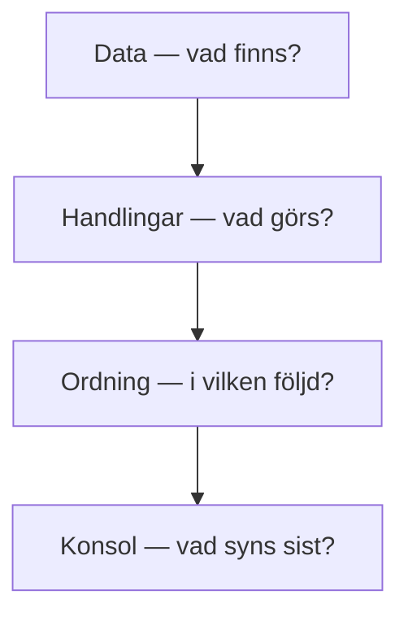
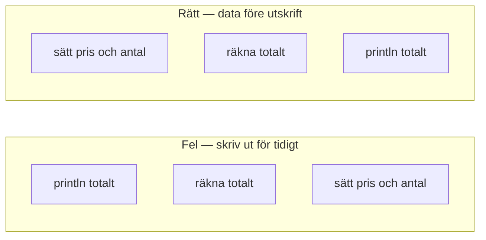
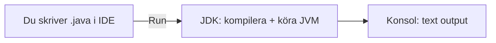
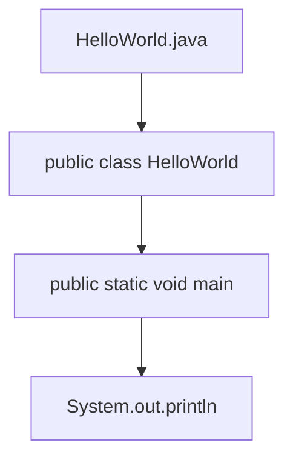
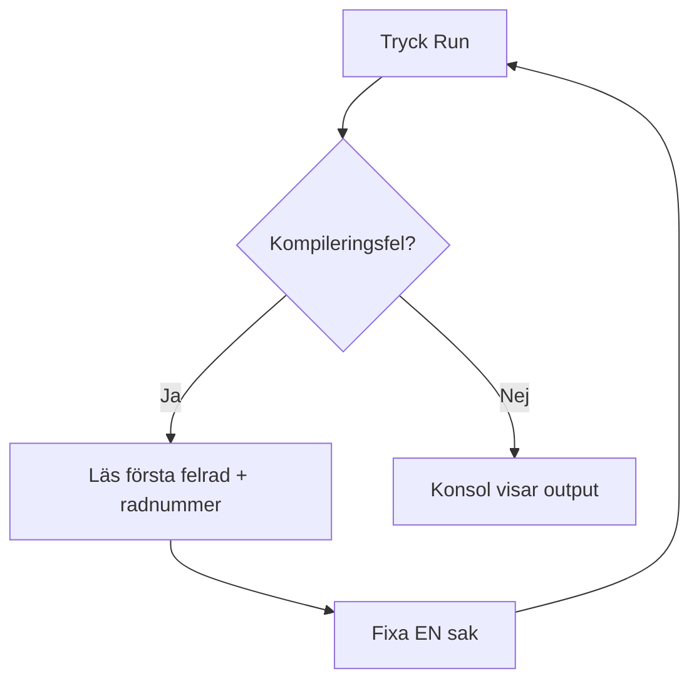

# 02 — Visuellt: data, verktyg och konsol

Samma postpaket- och expeditionstänk som i teoriguiden — nu som bild. Ingen avancerad Java-syntax här: bara **flöden** du ska kunna peka på.

GitHub renderar diagrammen nedan automatiskt.

---

## Datalogiskt tänkande — tre lager

**Vad diagrammet visar:** Du kan inte scanna paketet innan det packats — samma logik i kod.  
**Varför det hjälper:** När något “inte stämmer” frågar du: *vilken handling kom för tidigt?*  
**Kom ihåg / INTE:** Det här är **planering**, inte Java-syntax. Pseudokod och numrerade steg räcker.

**Målsvar (säg högt / skriv i README):** *“Data först, handlingar i rätt ordning, utskrift sist — annars finns inget att visa.”*

---

## Fel ordning vs rätt ordning

Till vänster: konsolen får inget vettigt att visa (eller fel värde).  
Till höger: samma problem — men datorn hinner **skapa** svaret innan det skrivs ut.

---

## JDK → IDE → konsol

**Vad diagrammet visar:** IDE:n **kör inte** Java själv — den skickar vidare till JDK.  
**Varför det hjälper:** Om Run inte funkar: är problemet i **editorn**, **JDK**, eller **koden**?  
**Kom ihåg / INTE:** JDK ≠ IDE. Konsol ≠ kodfil. Inget här är webbläsare eller Android.

**Målsvar (säg högt / skriv i README):** *“IDE skriver jag i; JDK kompilerar och kör; konsolen visar resultatet.”*

---

## Minsta program — var startar det?

**Startknappen** = `main`. Utan den vet JVM inte var programmet börjar.

**Om filnamn ≠ klassnamn:** kompilatorn klagar — tänk fel adress på paketet innan det ens scannats.

---

## Felsökning — läs fel som en karta

**Om du hoppar över READ:** du gissar — fixa en rad i taget istället.

---

## Checkpoint (privat)

Utan att titta på teoriguiden: rita (eller skriv) kedjan från `.java` till text i konsolen i tre steg. Jämför med diagrammet ovan.

När kartan sitter: [03 — Övningar](./03-ovningar.md).
