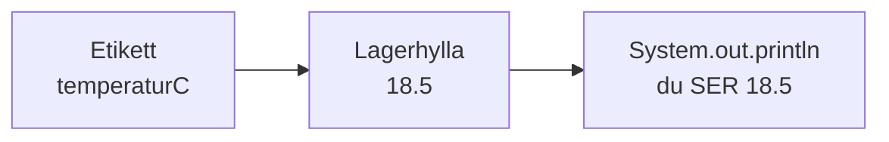
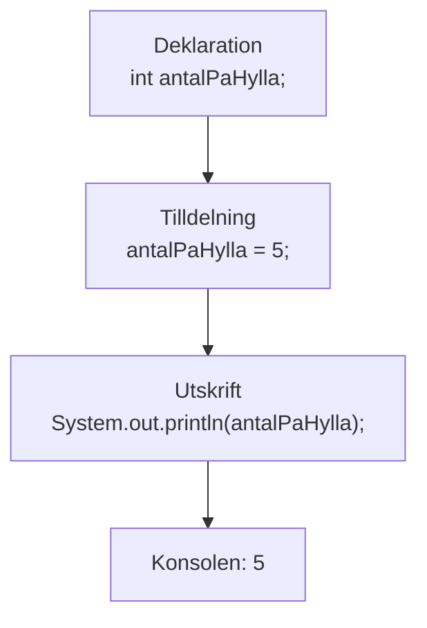
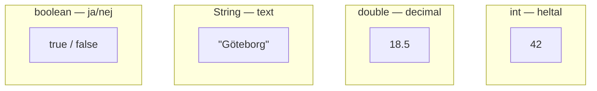
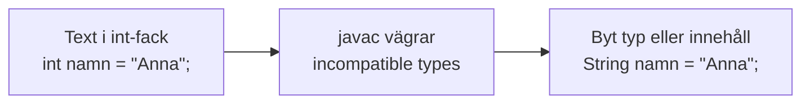
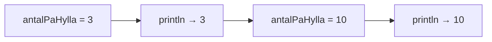

# 02 — Visuellt: lagerhyllor och etiketter

Samma bilder som i teoriguiden — nu som flöde. Bara `main`. Ingen `if`, ingen loop, ingen `Scanner`. GitHub renderar diagrammen automatiskt.

---

## Värdet måste ligga någonstans

**Vad diagrammet visar:** Etiketten är variabelnamnet. Hyllan är platsen i minnet. Konsolen visar en kopia av innehållet.  
**Kom ihåg / INTE:** Utskriften tömmer inte hyllan. Du kan `println` samma variabel flera gånger.

---

## Deklaration → tilldelning → utskrift

**Målsvar (säg högt / skriv i README):** *“Skapa platsen, fyll den, titta i den. Ordning spelar roll.”*

---

## Fyra hylltyper — rätt fack

**Kom ihåg / INTE:** `3.5` i `int`-facket → javac stoppar. `"true"` är text (String), inte boolean.

---

## Fel sortering = kompileringskrasch

**Vad diagrammet visar:** Felet är oftast *fel hylltyp*, inte “trasig dator”. Läs *cannot be converted to*.

---

## Samma etikett, nytt innehåll

**Kom ihåg / INTE:** Samma variabelnamn, uppdaterat värde — inte automatiskt en ny variabel.

---

## Checkpoint (privat)

Säg högt: etikett, deklaration, tilldelning, fyra typer, varför `println` inte tömmer. Jämför sen med diagrammen.

När kartan sitter: [03 — Övningar](./03-ovningar.md).
