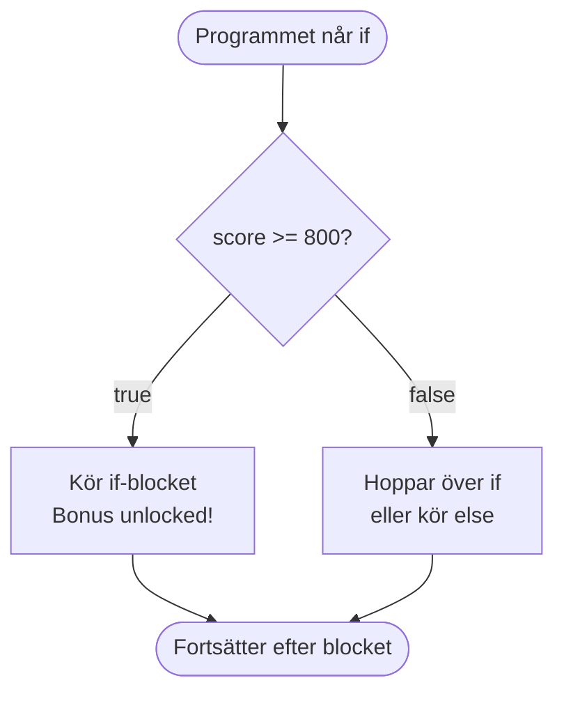
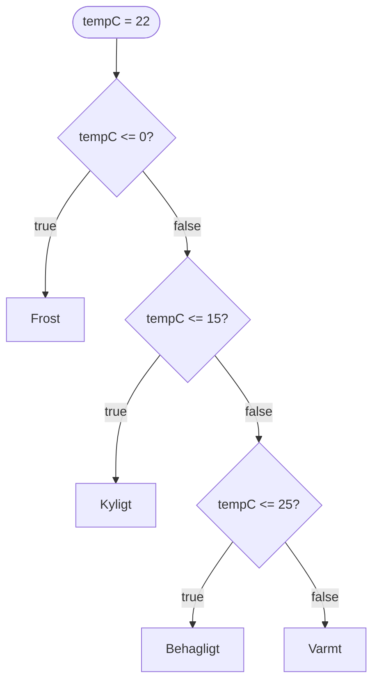
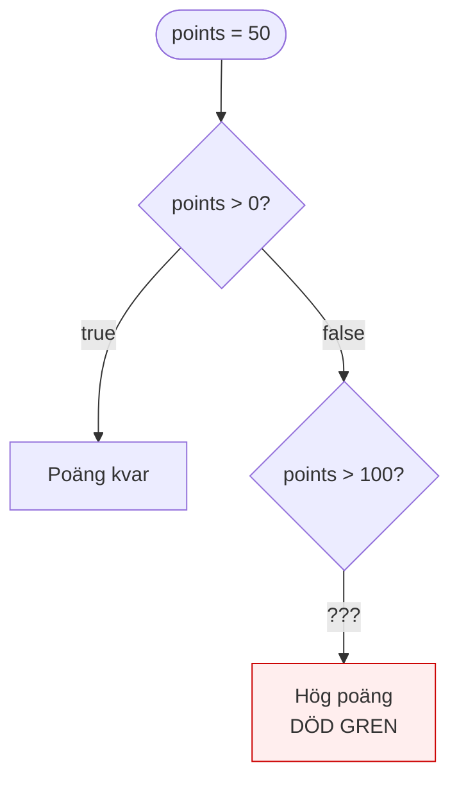
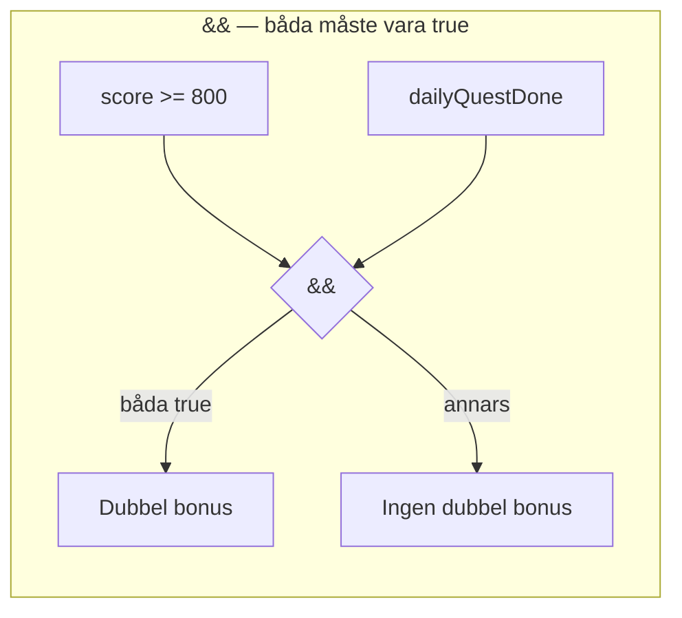
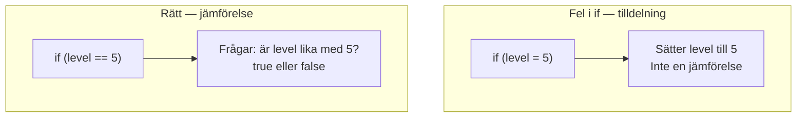
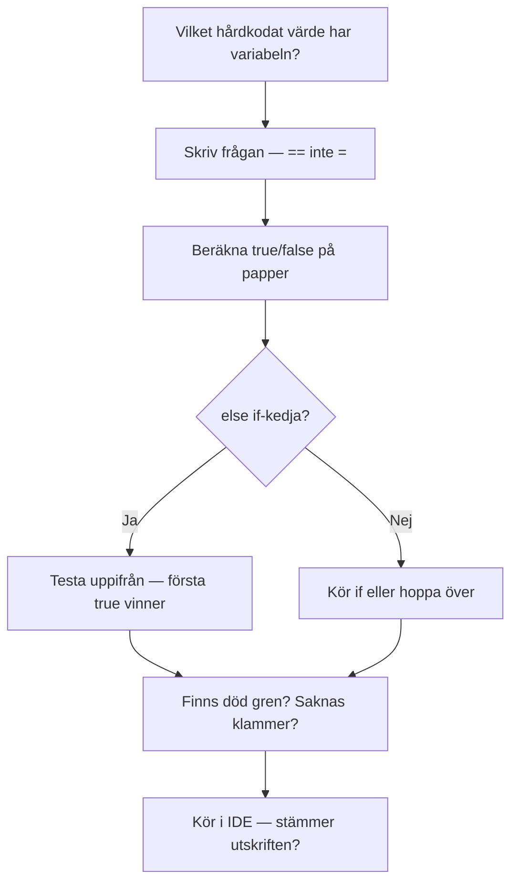

# 02 — Visuellt: Villkor och logik

Samma trafikljus-metafor som i teoriguiden — nu som bild. Ingen loop i diagrammen: ett hårdkodat värde, en väg genom grenarna.

GitHub renderar diagrammen nedan automatiskt.

---

## `if` / `else` — två vägar



**Vad diagrammet visar:** En fråga, högst två huvudvägar (plus att koden efter blocket alltid körs).  
**Varför det hjälper:** Du ser att false inte “stannar programmet” — det väljer annan gren eller inget.  
**Kom ihåg / INTE:** `if` upprepar inte. Det frågar **en gång** per körning.

---

## `else if`-stege — första sanna vinner



För `tempC = 22`: första false, andra false, tredje **true** → “Behagligt”. Grenarna under testas inte längre.

**Målsvar (säg högt / skriv i README):**  
*“I en else if-kedja testas frågorna uppifrån. Första true kör sitt block — resten hoppas över.”*

---

## Död gren — gren som aldrig nås



Om `points = 50`: första frågan true → “Poäng kvar”. Grenen `points > 100` **kan inte** nås när `points` redan var > 0 men ≤ 100 — och när `points > 100` hade första grenen redan varit true. (I det här exemplet är andra grenen meningslös.)

**Peka på papper:** Rita samma stege med ditt värde. Markera vilken ruta som aldrig kan nås.

---

## `&&` och `||` — kombinera frågor



```mermaid
flowchart LR
  subgraph eller ["|| — minst en true"]
    B1["isMember"] --> R2{||}
    B2["orderTotal >= 500"] --> R2
    R2 -->|minst en true| SHIP["Fri frakt"]
    R2 -->|båda false| PAY["Betala frakt"]
  end
```

**Kom ihåg:** `&&` = strängare (allt måste stämma). `||` = mildare (ett räcker).

---

## `=` vs `==` — tilldela vs jämför



**Om du blandar ihop dem:** programmet ändrar data när du trodde du bara frågade.

---

## Metod som flöde — felsök logik

När du tvekar — följ pilarna. Det är samma metod som i teoriguiden.



---

## Checkpoint (privat)

1. Rita en egen `else if`-stege (tre grenar) för **spelpoäng** eller **temperatur**.  
2. Markera med rött vilken gren som vore död om du byter ordning på två frågor.  
3. Skriv en kombination med `&&` och en med `||` — vilken är strängast?

När kartan sitter: [03 — Övningar](./03-ovningar.md).
