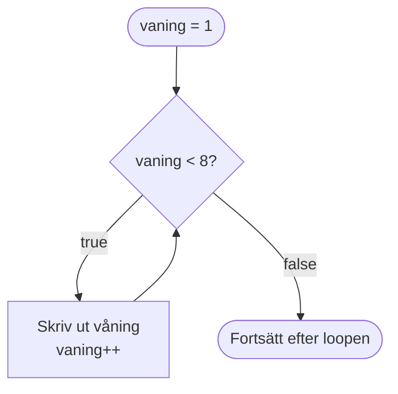
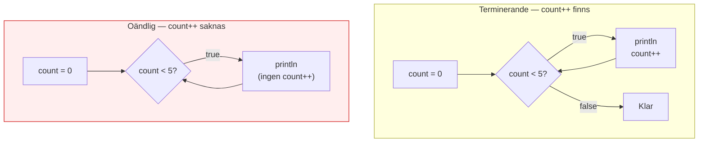
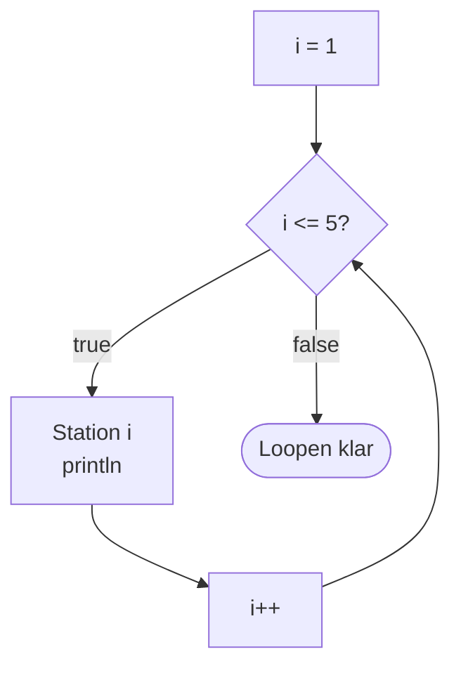
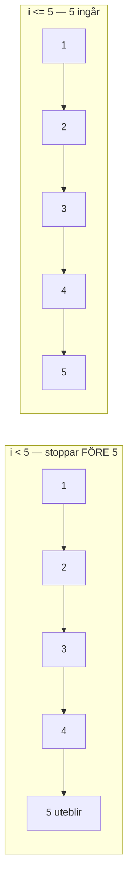
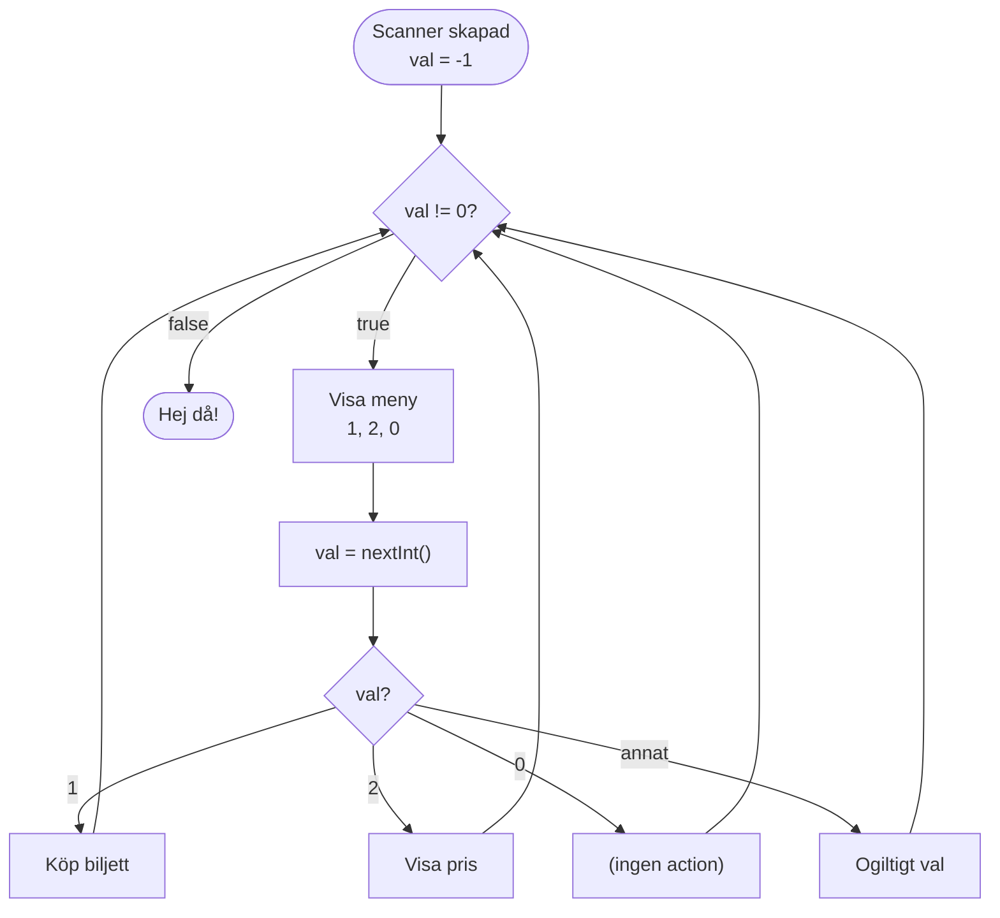
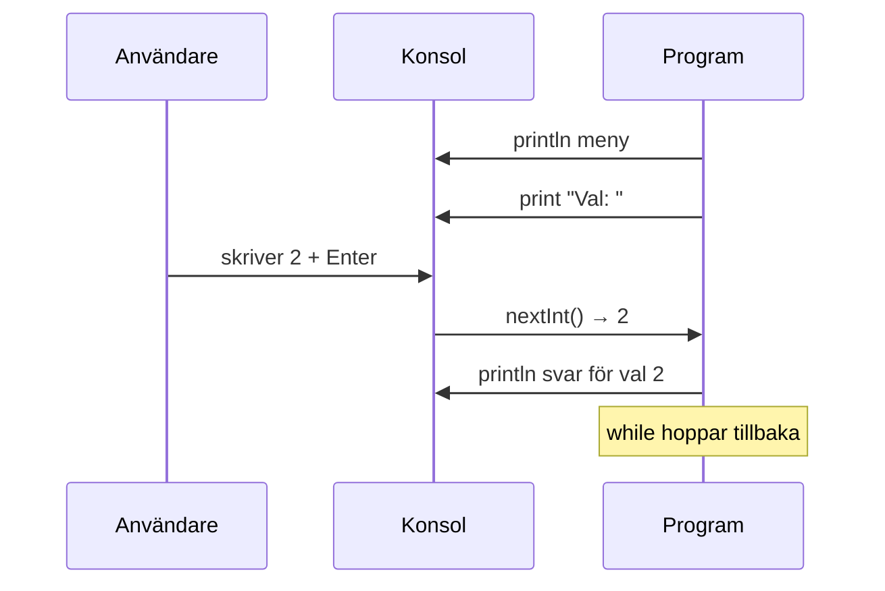
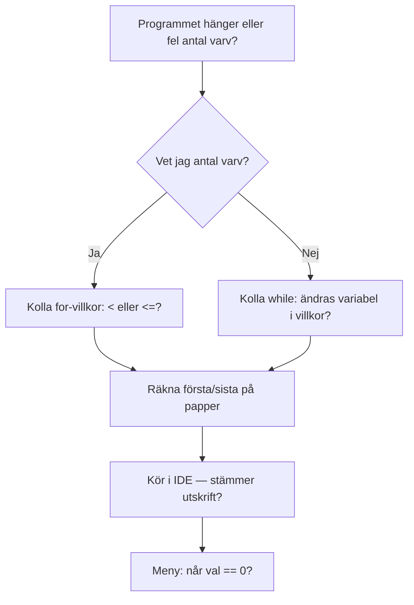

# 02 — Visuellt: Loopar och meny-val

Samma hisstur-, löpband- och automat-metaforer som i teoriguiden — nu som flödeskartor. Ingen OOP i diagrammen: bara `main`, loopar och ett menyval.

GitHub renderar diagrammen nedan automatiskt.

---

## `while` — fråga, kropp, hopp tillbaka

**Vad diagrammet visar:** Villkoret testas **före** varje varv (entry-check). Kroppen ändrar `vaning` — annars fastnar pilen på `true` för evigt.  
**Varför det hjälper:** Du ser att “efter loopen” bara nås när frågan blir false.  
**Kom ihåg / INTE:** `if` har ingen tillbaka-pil — det frågar en gång.

**Målsvar (säg högt / skriv i README):**  
*“while testar villkoret, kör kroppen, hoppar tillbaka. Något i kroppen måste göra att villkoret så småningom blir false.”*

---

## Oändlig vs terminerande — löpbandet

**Peka:** I höger gren blir `count` aldrig större — pilen till `true` loopar för evigt tills du stoppar programmet i IDE:n.

---

## `for` — start, villkor, steg

**Vad diagrammet visar:** Init körs **en gång**. Sedan samma cykel som `while`, men `i++` sitter i for-huvudet.  
**Off-by-one:** Byt `i <= 5` till `i < 5` i huvudet — sista stationen (5) försvinner.

---

## `<` vs `<=` — sista stationen med eller utan

**Metod på papper:** Skriv första och sista tal du vill ha. Markera om sista ska ingå → `<=` eller justera gränsen.

---

## Meny-loop — automaten tills 0

**Kom ihåg:** Efter val **hoppar** programmet tillbaka till `val != 0` — inte till `main`-slut. Först när `val == 0` blir villkoret false.

**Målsvar (säg högt / skriv i README):**  
*“Meny-loopen visar alternativ, läser val, hanterar, och frågar igen tills val är 0.”*

---

## `Scanner` i flödet

**INTE:** `nextInt()` skriver inte menyn — den **väntar** på input efter att du skrivit `print`.

---

## Metod som flöde — felsök loop

---

## Checkpoint (privat)

1. Rita en egen `while` med tre varv — markera var `count++` sitter och var loopen lämnar.  
2. Rita samma loop som `for` — var sitter start, villkor, steg?  
3. Rita meny-loopen med dina egna val (minst två + avsluta).  
4. Markera med rött var en oändlig loop skulle uppstå om du tar bort ett steg.

När kartan sitter: [03 — Övningar](./03-ovningar.md).
