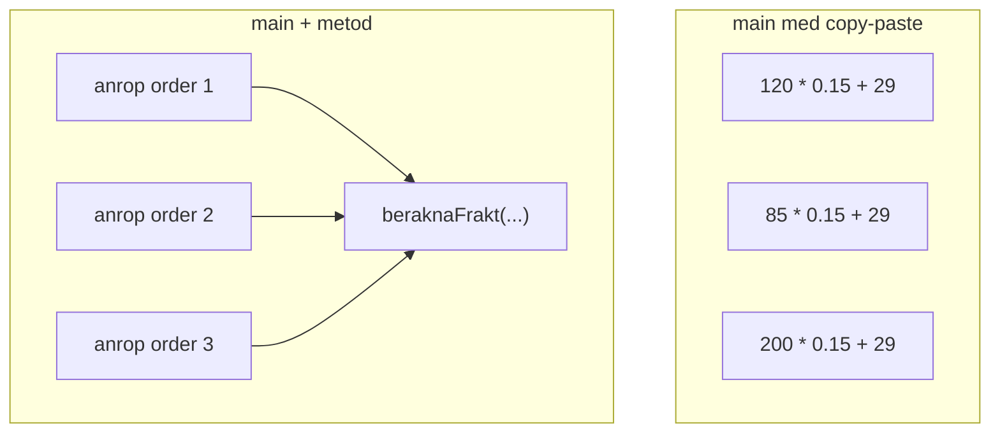
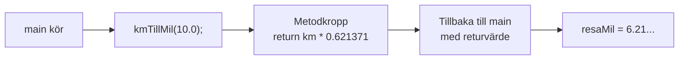
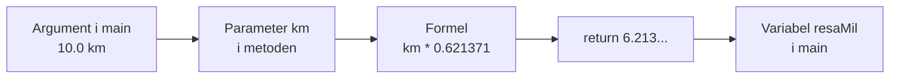
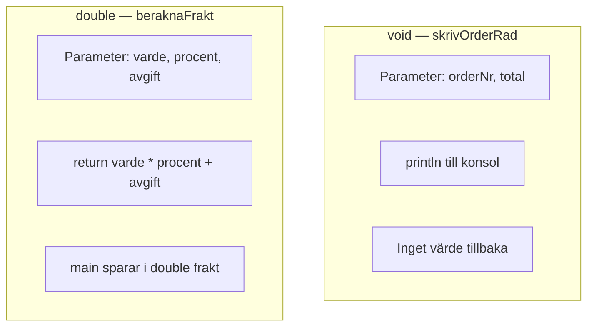
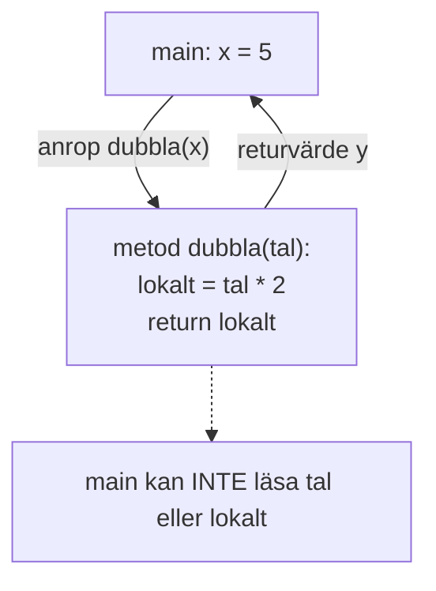
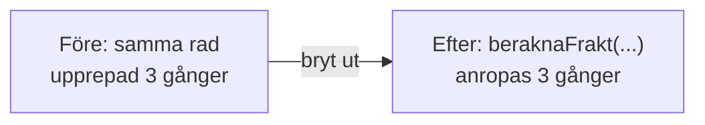
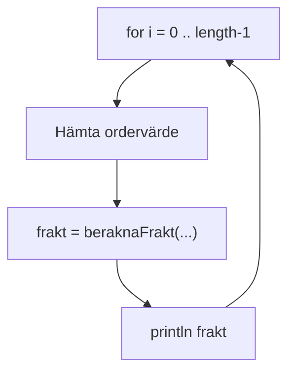

# 02 — Visuellt: miniräknare, ingång och retur

Samma bilder som i teoriguiden — nu som flöde. Metoder i `Main.java`. Ingen egen klass. GitHub renderar diagrammen automatiskt.

---

## Duplicerat vs en metod

**Vad diagrammet visar:** En kropp, flera anrop. Ändrar du formeln ändras alla ordrar samtidigt.  
**Kom ihåg / INTE:** Copy-paste är inte “snabbare” — det är fler ställen att glömma.

---

## Anrop hoppar in och tillbaka

**Målsvar (säg högt / skriv i README):** *“Anropet pausar main, kör metoden, fortsätter med returvärdet om typen inte är void.”*

---

## Parameter in — return ut

**Kom ihåg / INTE:** Argument och parameter **behöver inte heta likadant**. Antal och typ måste matcha.

---

## void vs return

**Vad diagrammet visar:** `void` = jobb klart efter utskrift. `return` = main får ett tal att använda vidare.  
**Kom ihåg / INTE:** `int x = skrivOrderRad(...);` på void → kompileringsfel.

---

## Scope — parametrar stannar i metoden

**Målsvar (säg högt / skriv i README) — scope:** *“Parametrar och lokala variabler syns bara inuti metoden. main får bara returvärdet.”*

---

## Refaktorering — före och efter

**Kom ihåg / INTE:** Refaktorering = samma beteende, renare struktur — inte ny funktion som användaren inte bad om.

---

## Loop + metod

**Vad diagrammet visar:** Loopen styr **hur många gånger**; metoden styr **hur** varje frakt räknas.

---

## Checkpoint (privat)

Säg högt: en kropp flera anrop, parameter vs argument, void vs return, varför scope stoppar `main` från att läsa parametrar. Jämför sen med diagrammen.

När kartan sitter: [03 — Övningar](./03-ovningar.md).
