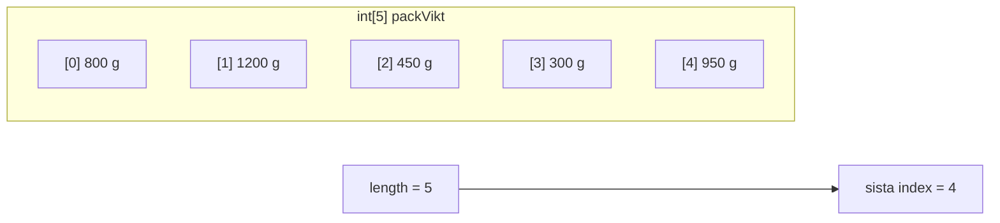
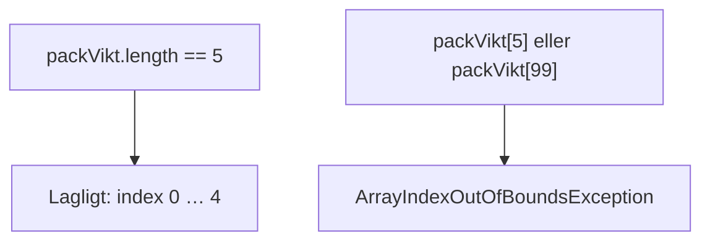
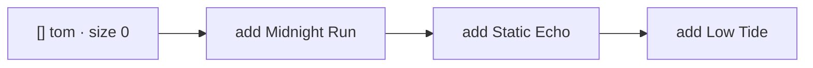
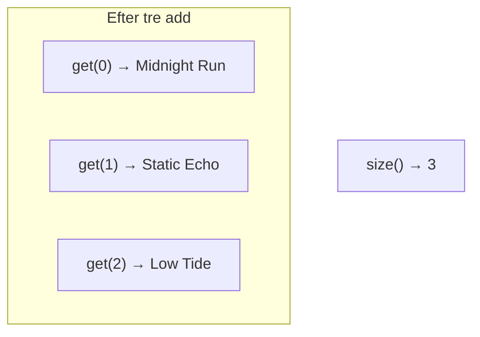
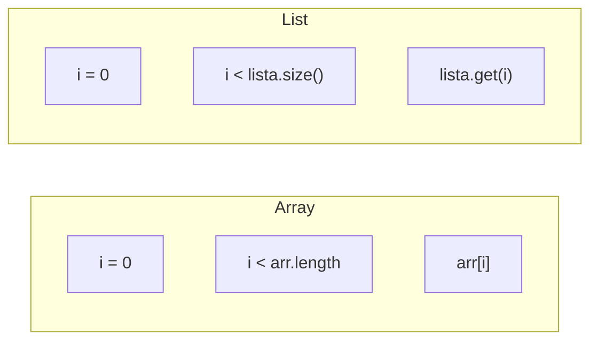
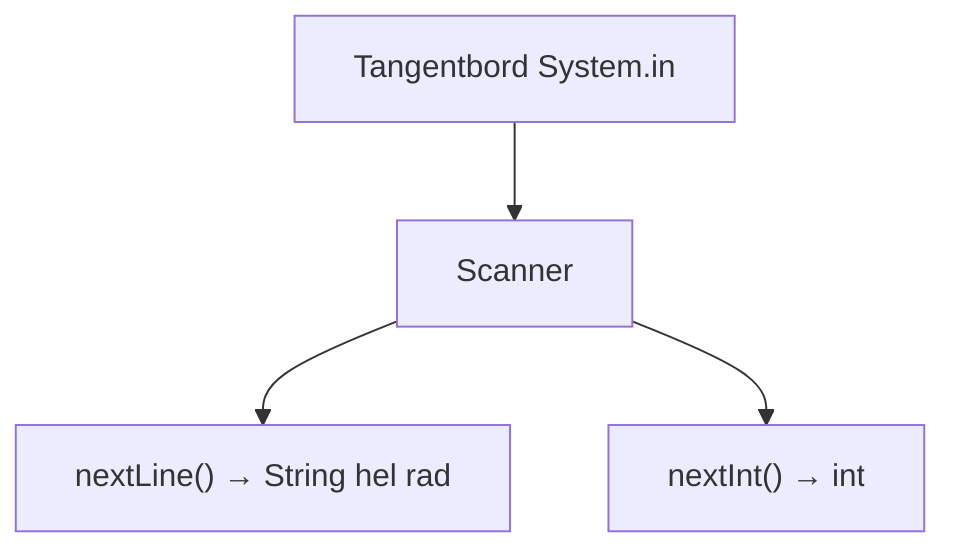
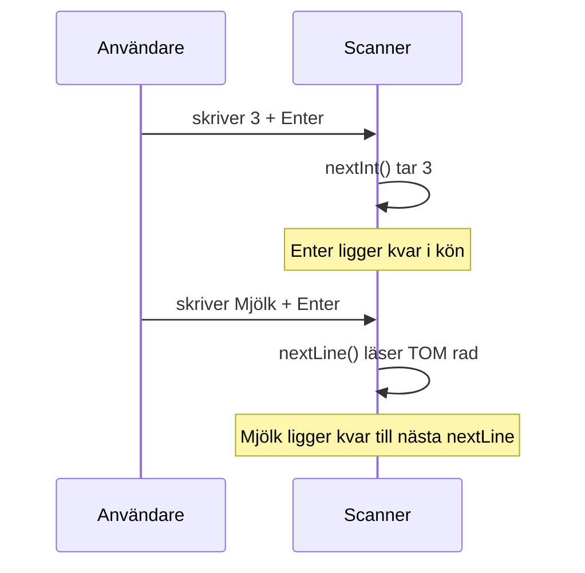
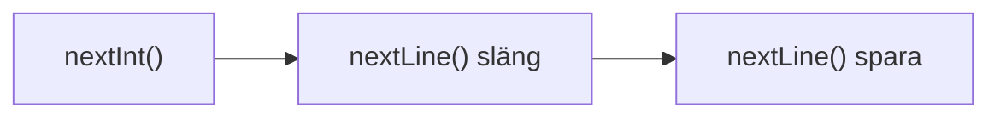
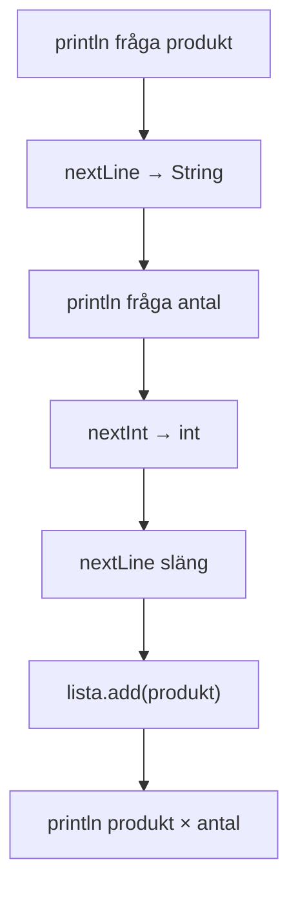
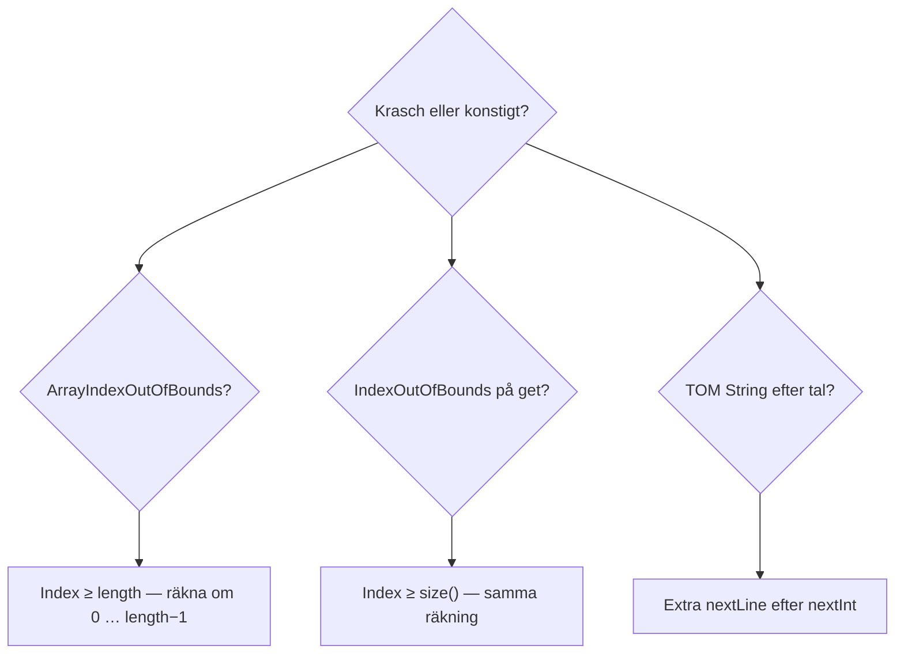

# 02 — Visuellt: array, lista och Scanner

Samma packnings- och spellistetänk som i teoriguiden — nu som kartor du kan peka på. GitHub renderar Mermaid automatiskt.

---

## Array — fasta fack, index 0

**Vad diagrammet visar:** Fem fack, numrerade 0–4. `length` är 5 — men index 5 finns inte.  
**Varför det hjälper:** Off-by-one: loop ska stanna **före** `length`, inte **på** `length`.  
**Kom ihåg / INTE:** Array växer inte. Ett sjätte föremål kräver ny array eller annan struktur.

**Målsvar (säg högt / skriv i README):** *“length är antal fack; sista index är length minus 1; loop: i från 0, i mindre än length.”*

---

## Index utanför — krasch

**Problem först:** Du räknar som människa (“femte facket = 5”). Java säger nej.

---

## ArrayList — växer vid add

**Vad diagrammet visar:** Du bestämmer inte storlek i förväg. Varje `add` tar ett fack till.  
**Kom ihåg / INTE:** `get(3)` när `size()` är 3 → `IndexOutOfBoundsException` (samma idé som array, annat namn).

---

## Array vs List — samma loop, olika ord

**Målsvar (säg högt / skriv i README):** *“Samma for-mönster — byt length mot size() och hakparentes mot get.”*

---

## Scanner — två läsare, samma kassa

**Vad diagrammet visar:** En Scanner, två metoder — olika **typ** tillbaka.  
**Kom ihåg / INTE:** `nextInt` läser **inte** resten av raden som text.

---

## Fällan: nextInt lämnar Enter

**Fix i diagram:**

**Målsvar (säg högt / skriv i README):** *“Efter nextInt: en nextLine som jag inte sparar — sen den riktiga nextLine för text.”*

---

## Inköpslista — data genom kedjan

**Ordning spelar roll:** Fråga → läs → fråga → läs → **släng Enter** → spara i lista.

---

## Felsökningskarta

---

## Checkpoint (privat)

Rita på papper: array med 3 fack + en lista efter två `add`. Markera index 0 och sista lagliga index för båda. Lägg till pil: vad händer vid `get(3)` när size är 3?

När kartan sitter: [03 — Övningar](./03-ovningar.md).
