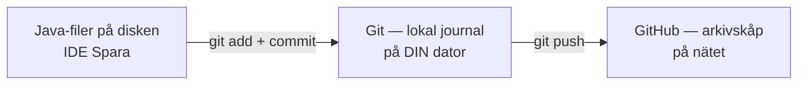
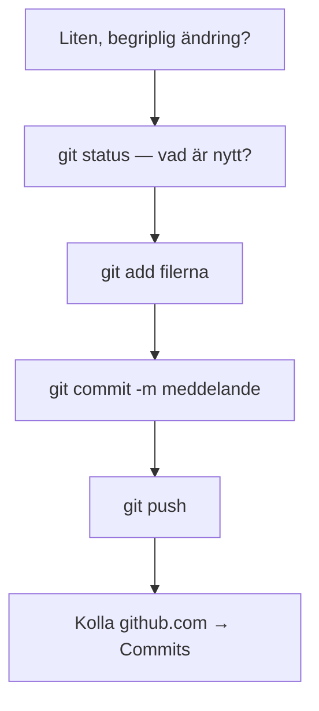
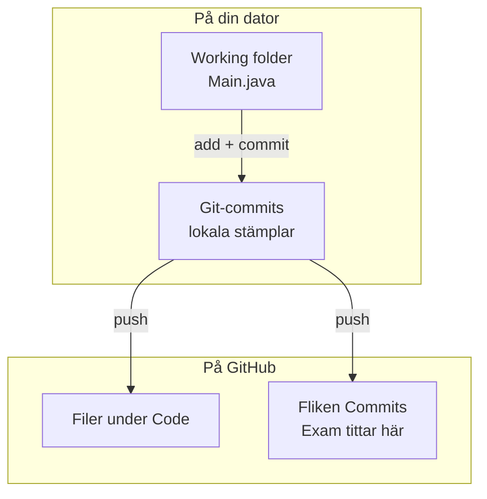
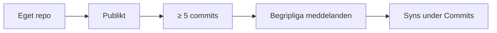

# 02 — Visuellt: Git-kedjan (eget repo)

Samma **verkstadsjournal**-bild som i teoriguiden — nu som flöde. Ingen gren-karta: add → commit → push + fliken Commits räcker.

GitHub renderar diagrammen nedan automatiskt.

---

## Var sakerna bor

**Vad diagrammet visar:** Spara i IDE:n stannar till vänster. Historiken sitter i mitten. Examinationen tittar till höger.  
**Kom ihåg / INTE:** Git ≠ GitHub. Utan push syns inget under Commits på github.com.

---

## Kedjan när du har en ändring

**Om du hoppar till push direkt:** ofta inget att skicka, eller fel filer. Gå tillbaka till status → add → commit.

**Målsvar (säg högt / skriv i README):**  
*“Add väljer, commit sparar ögonblicksbilden, push skickar den till GitHub. Sedan kollar jag fliken Commits.”*

---

## Lokalt vs GitHub — två platser, samma historik (efter push)

**Vad det INTE är:** Att filerna syns under **Code** räcker inte ensamt — öppna också **Commits** och läs meddelandena.

---

## Exam 1 — vad som ska synas

Till vänster utan kedjan: “det ligger på min dator”.  
Till höger: något en bedömare kan öppna via din Moodle-länk.

---

## Checkpoint (privat)

Utan att titta på teoriguiden: säg kedjan högt (status → add → commit → push → Commits) och varför Exam 1 kräver publikt repo. Jämför sen med diagrammen.

När kartan sitter: [03 — Övningar](./03-ovningar.md).
