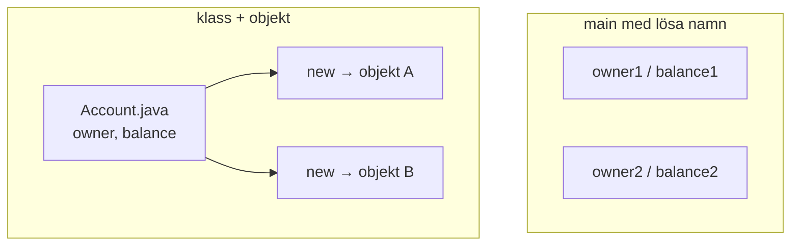
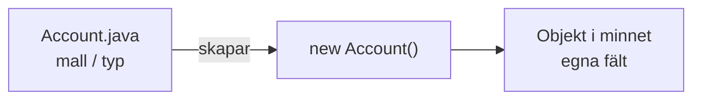
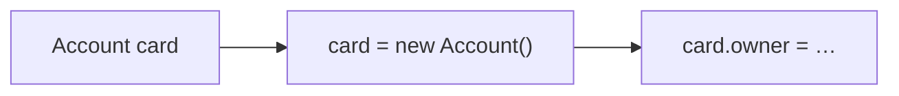
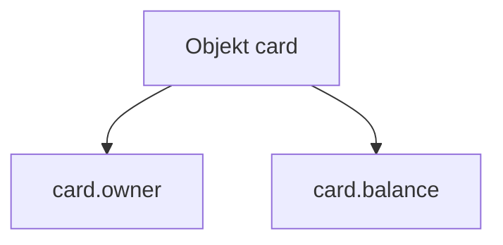
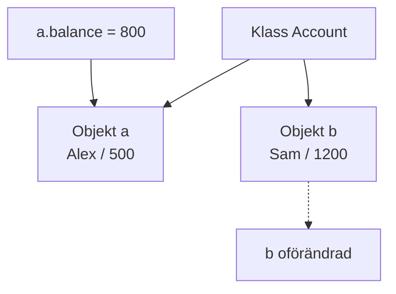
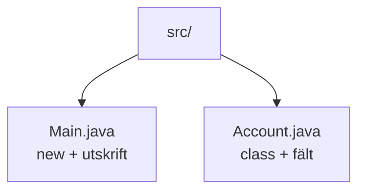

# 02 — Visuellt: mall, instans och fält

Samma bilder som i teoriguiden — nu som flöde. Klass `Account`, objekt via `new`, fält `owner` / `balance`. Ingen `deposit`. GitHub renderar diagrammen automatiskt.

---

## Lösa variabler vs klass

**Vad diagrammet visar:** Klassen beskriver fälten en gång. Varje `new` ger en egen instans.  
**Kom ihåg / INTE:** Två konton ≠ två klassfiler.

---

## Klass (mall) vs objekt (instans)

**Målsvar (säg högt / skriv i README):** *“Klassen är mallen. new bygger instansen. Fälten lever på objektet.”*

---

## new innan punkt

**Kom ihåg / INTE:** Punkt utan `new` → ofta `NullPointerException`. Först skapa, sen fylla.

---

## Punktnotation — öppna luckorna

**Vad diagrammet visar:** Variabeln `card` pekar på objektet. Fälten nås med `card.fält`.  
**Kom ihåg / INTE:** `println(card)` ≠ innehållet i luckorna.

---

## Två objekt — egna saldon

**Målsvar (säg högt / skriv i README):** *“Två new, två adresser. Ändrar jag a rör jag inte b.”*

---

## Filträd — Main och Account

**Kom ihåg / INTE:** `public class Account` måste heta `Account.java`. Inte `Konto.java`.

---

## Checkpoint (privat)

Säg högt: klass vs objekt, varför `new` först, varför utskrift av fält, varför filnamn matchar. Jämför sen med diagrammen.

När kartan sitter: [03 — Övningar](./03-ovningar.md).
