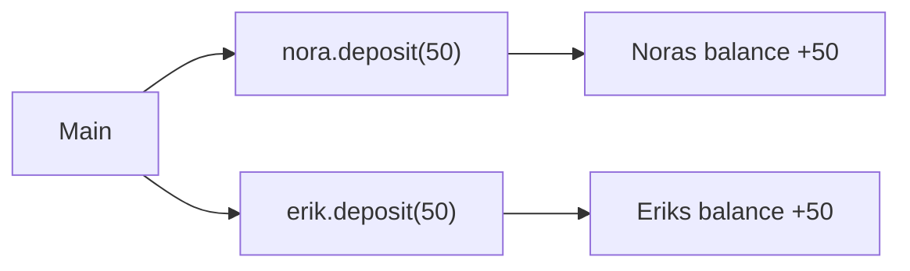
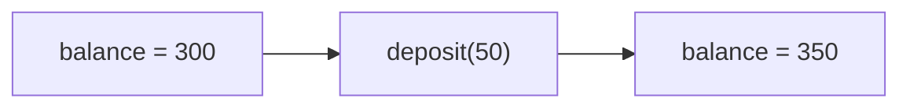
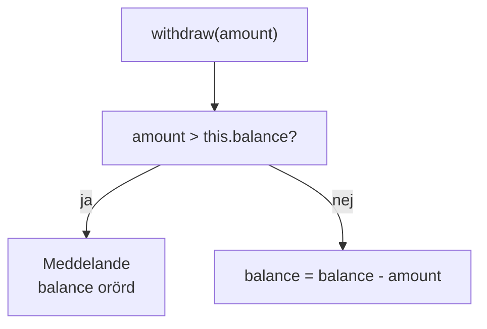
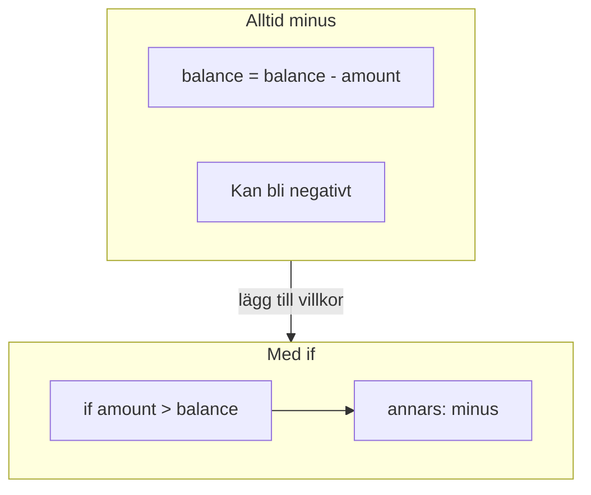
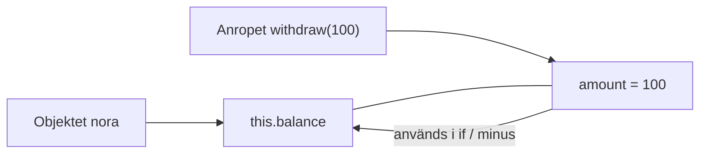
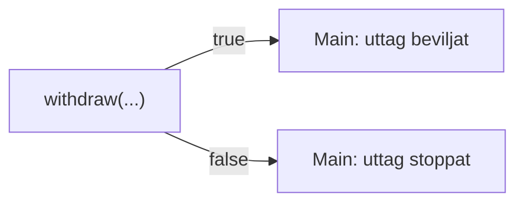

# 02 — Visuellt: objektet gör jobbet

Samma bilder som i teoriguiden — nu som flöde. `deposit` / `withdraw` på `Account`. GitHub renderar diagrammen automatiskt.

---

## Anrop väljer objekt

**Vad diagrammet visar:** Punkten väljer **vilket** konto som ändras. Samma metodkod — olika objekt i minnet.  
**Kom ihåg / INTE:** En `static`-metod i `Main` som “råkar” ändra ett fält — här bor knappen på kontot.

---

## `deposit` — före och efter

**Målsvar (säg högt / skriv i README):** *“deposit lägger till amount på this.balance. Inget stoppvillkor krävs för vanlig insättning.”*

---

## `withdraw` — två vägar

**Vad diagrammet visar:** Frågan kommer **före** minus. Stoppvägen lämnar saldot som det var.  
**Kom ihåg / INTE:** Meddelande *och* minus = regeln är trasig.

---

## Problem först vs regel

**Kom ihåg / INTE:** “Det kompilerar” ≠ “regeln håller”. Exam 1 bryr sig om **beteendet** vid för stort belopp.

---

## `this` vs `amount`

**Målsvar (säg högt / skriv i README) — this:** *“this pekar på objektet som fick anropet. amount är bara parametern.”*

---

## Valfritt — boolean tillbaka till Main

**Kom ihåg / INTE:** `boolean` ersätter inte meddelandet + oförändrat saldo — det **kompletterar** så Main kan styra nästa steg.

---

## Checkpoint (privat)

Säg högt: objekt före punkt, deposit ökar, withdraw har två vägar, this vs amount. Jämför sen med diagrammen.

När kartan sitter: [03 — Övningar](./03-ovningar.md).
