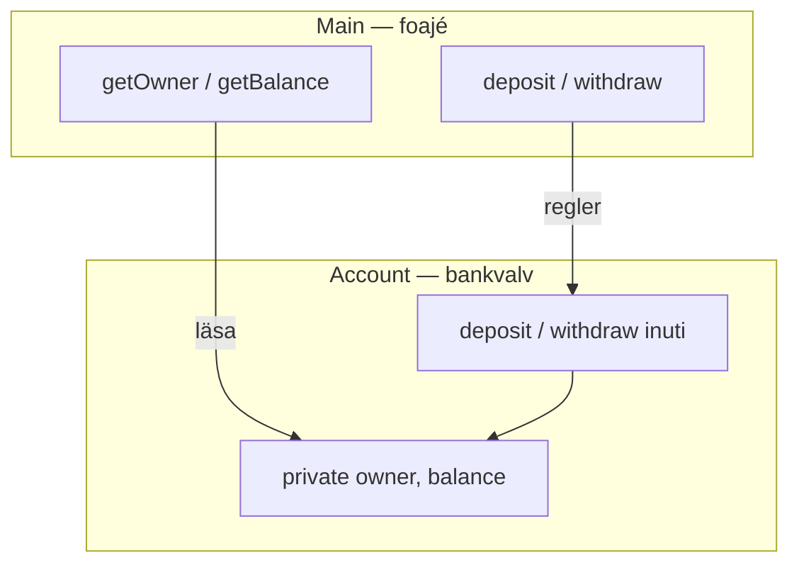
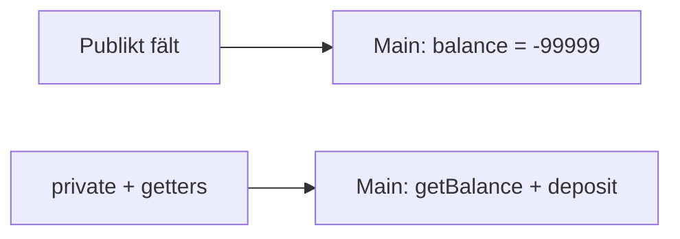
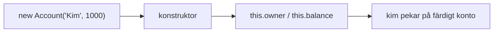
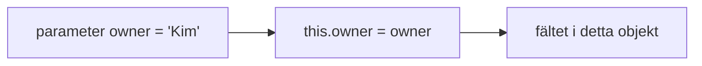
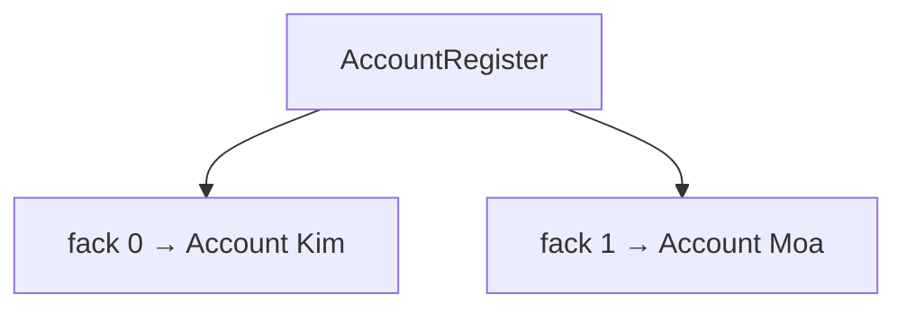
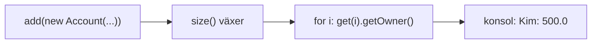
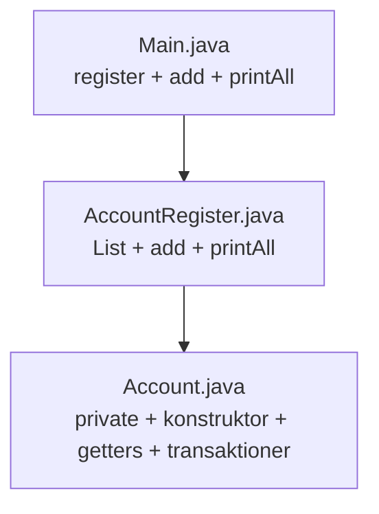

# 02 — Visuellt: bankvalv, konstruktor och valvbok

Samma bilder som i teoriguiden — nu som flöde. `private`, getters, konstruktor och `AccountRegister`. GitHub renderar diagrammen automatiskt.

---

## Inkapsling — foajé vs valv

**Vad diagrammet visar:** `Main` når state via **dörrar** — inte direkt på facket.  
**Kom ihåg / INTE:** `private` gömmer fält **för Main**, inte för metoder **inuti** `Account`.

---

## Bakdörren — publikt vs private

**Målsvar (säg högt / skriv i README — Exam Q1):** *“Publikt fält = Main kan skriva vad som helst. private stoppar det — jag pekar på private balance i README.”*

---

## Getters — läs genom luckan

**Kom ihåg / INTE:** Getter **returnerar** — den ändrar inte saldo. `setBalance` vore skriv-dörr (stryk).

---

## Konstruktor — ett `new`, ett fyllt valv

**Vad diagrammet visar:** Fälten fylls **inuti** klassen vid födelse — Main sätter inte `kim.owner = ...` efter `private`.

---

## `this` i konstruktorn

**Målsvar (säg högt / skriv i README):** *“this = kontot som new bygger. Vänster = fält, höger = argument.”*

---

## Valvbok — lista håller pekare

**Vad diagrammet visar:** Listan lagrar **referenser** till konton — inte kopior av hela klassen.  
**Kom ihåg / INTE:** `println(accounts.get(0))` = adress — inte ägare/saldo.

---

## `add` och `printAll`

**Kom ihåg / INTE:** `List<Account>` som typ, `new ArrayList<>()` vid skapande — inte `ArrayList` som deklarerad typ.

---

## Tre filer

---

## Checkpoint (privat)

Säg högt: valv/private, getter vs fält, konstruktor vid `new`, lista i register, Exam Q1-pekning. Jämför sen med diagrammen.

När kartan sitter: [03 — Övningar](./03-ovningar.md).
