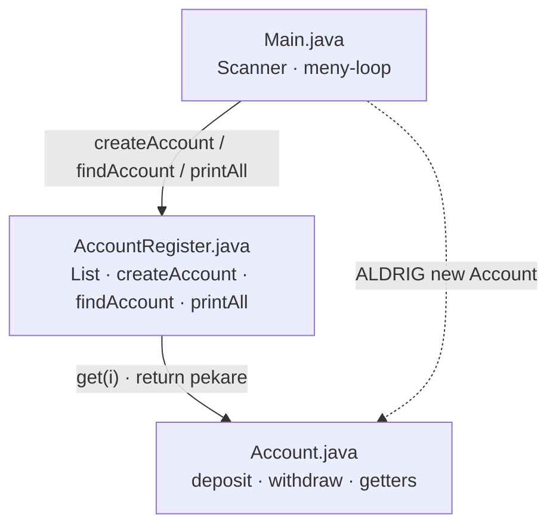
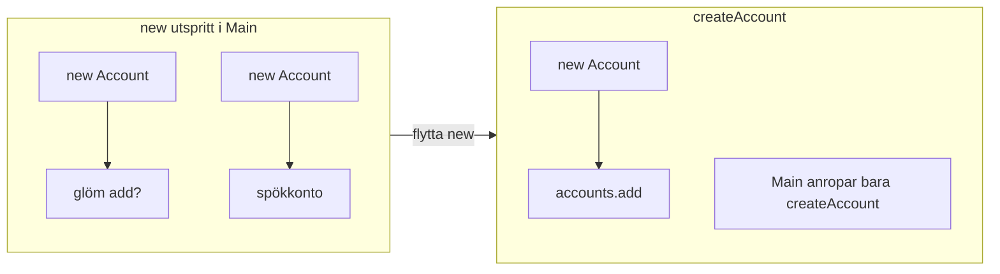
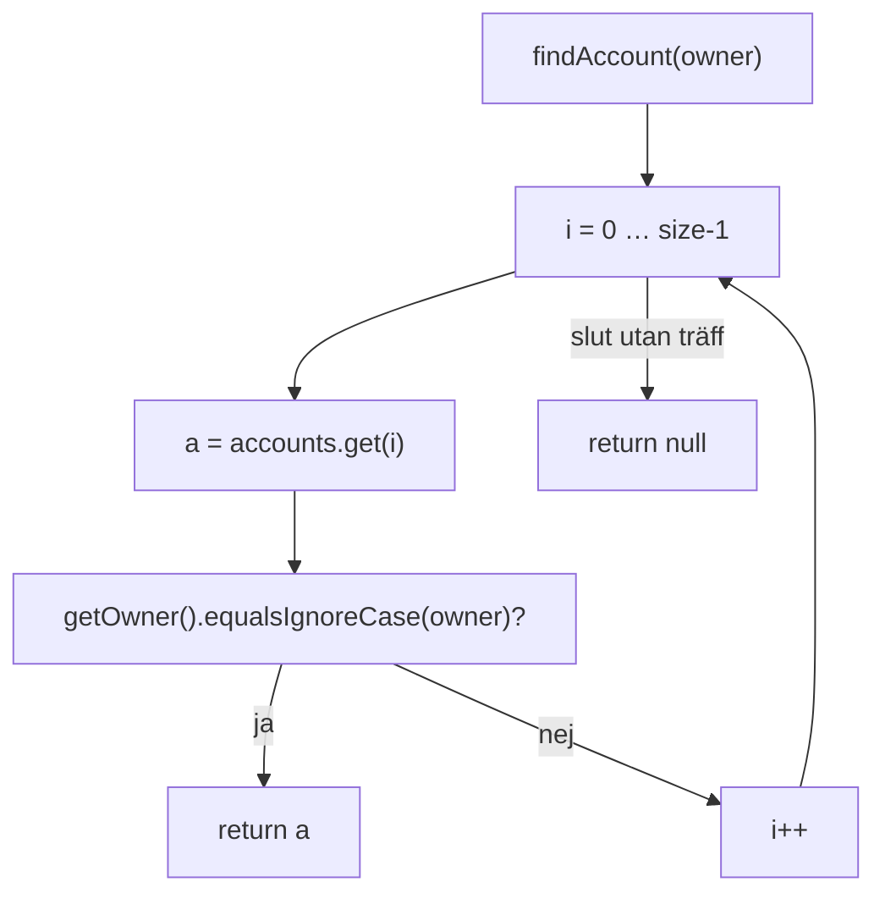
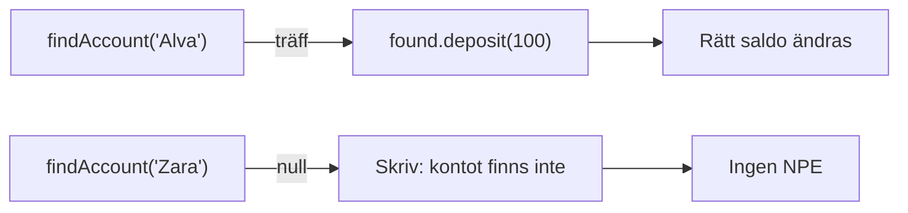
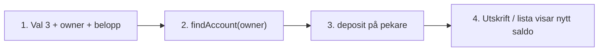
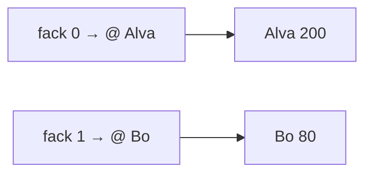
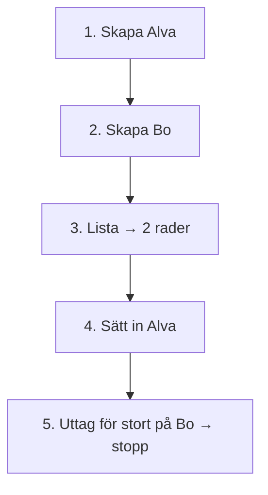

# 02 — Visuellt: factory, sök och meny

Samma bilder som i teoriguiden — nu som flöde. `createAccount`, `findAccount`, meny 1–5. GitHub renderar diagrammen automatiskt.

---

## Tre filer — ansvar

**Vad diagrammet visar:** Main anropar register. Register äger listan och skapandet. Main skapar inte konton direkt.  
**Kom ihåg / INTE:** Pil från Main till `new Account` ska inte finnas efter refaktorering.

---

## Factory — en dörr för `new`

**Målsvar (säg högt / skriv i README):** *“new Account står i createAccount. Main beställer — fabriken bygger och lägger i listan.”*

---

## `findAccount` — linjär sökning

**Kom ihåg / INTE:** Sök skapar inte `new Account`. Miss = `null`, inte tomt objekt.

---

## Träff vs miss i Main

**Vad diagrammet visar:** Null-kollen **före** punkt-metod.  
**Kom ihåg / INTE:** `found.deposit` när `found` är `null` → krasch.

---

## Menyval 3 — stegkedja (Exam README Q3)

**Målsvar (säg högt / skriv i README):** *“Inmatning → hitta objekt → metod på objekt → synlig effekt i konsolen.”*

---

## Lista håller pekare

**Kom ihåg / INTE:** `get(0)` är “första facket idag” — inte “alltid Alva” om ordningen ändras.

---

## Testkedja via meny

**Kom ihåg / INTE:** Stoppat uttag = samma regel som [09-transaktioner](../../vecka-39/09-transaktioner/) — meddelande + oförändrat saldo.

---

## Checkpoint (privat)

Säg högt: factory-plats, sök returnerar pekare eller null, meny kopplar val till register. Jämför sen med diagrammen.

När kartan sitter: [03 — Övningar](./03-ovningar.md).
