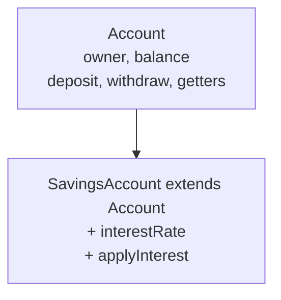
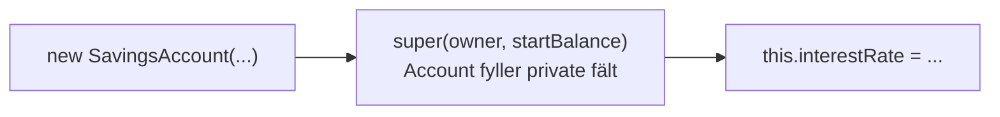
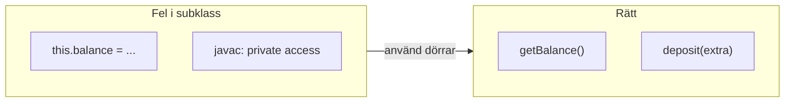
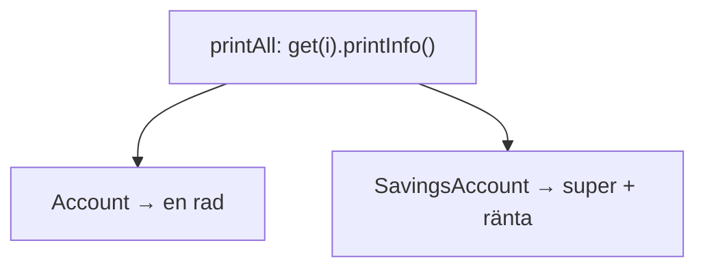
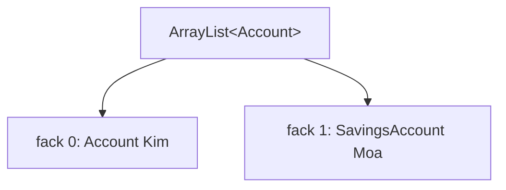
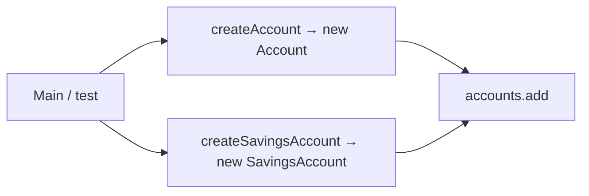
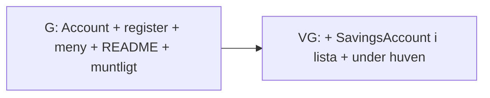
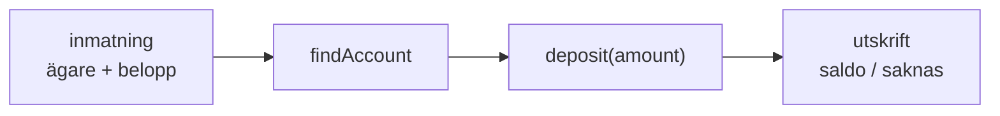
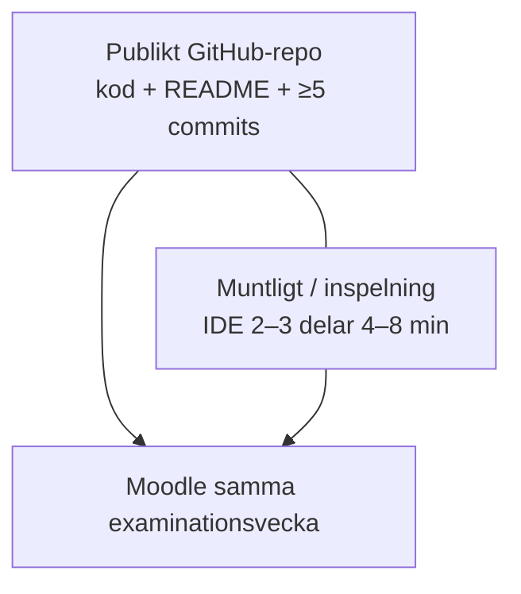
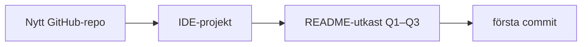

# 02 — Visuellt: arv, lista och examination

Samma bilder som i teoriguiden — nu som flöde. GitHub renderar diagrammen automatiskt.

---

## Arv — basklass och subklass

**Vad diagrammet visar:** Subklassen **är** ett konto plus eget. Basklassen försvinner inte.  
**Kom ihåg / INTE:** INTE `implements`. INTE två orelaterade klasser.

**Målsvar (säg högt / skriv i README):** *“extends = samma Account-dörrar + tillbyggnad.”*

---

## Konstruktor — super först

**Kom ihåg / INTE:** `this.interestRate` **före** `super` → javac-fel.

---

## Private mur — dörr, inte lucka

**Målsvar (säg högt / skriv i README):** *“Arv öppnar inte private. applyInterest via getBalance + deposit.”*

---

## `@Override` — två konton, samma anrop

**Kom ihåg / INTE:** Loopen behöver inte veta vilken typ — objektet vet sin klass.

---

## Polymorfism — en lista

**Kom ihåg / INTE:** INTE bara `ArrayList<SavingsAccount>` om vanliga konton också ska in.

---

## Factory VG — syskon-dörr

**Vad diagrammet visar:** Båda `new` i `AccountRegister` — inte utspritt i `Main`.

---

## G vs VG

**Kom ihåg / INTE:** G = full OOP på inkapsling/factory — VG lägger **arv i appen**.

---

## README Q3 — stegkedja (meny “sätt in”)

**Målsvar (säg högt / skriv i README):** *“Ett menyval = in → objekt → metod → ut.”*

**Kom ihåg / INTE:** INTE “while-loopen” utan objekt och metodnamn.

---

## Examination — två leveranser samma vecka

**Vad diagrammet visar:** Repo och röst hör ihop — samma projekt, samma vecka.  
**Kom ihåg / INTE:** INTE webbdemo. INTE bara README utan IDE.

---

## Exam-repo start (struktur)

**Kom ihåg / INTE:** Det här paketet = utkast — färdig app = examinationsveckan.

---

## Checkpoint (privat)

Säg högt: extends, super, private via dörrar, en lista, README stegkedja, två exam-leveranser. Jämför med diagrammen.

När kartan sitter: [03 — Övningar](./03-ovningar.md).
