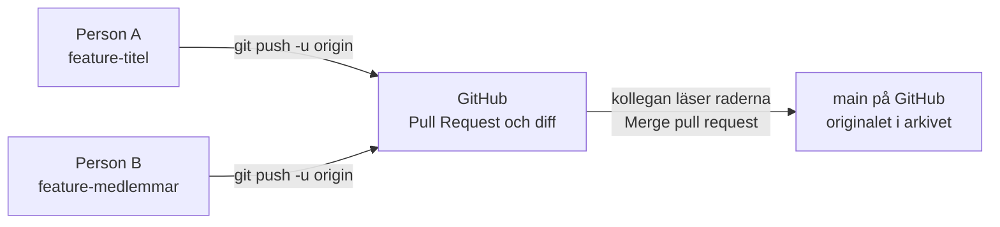
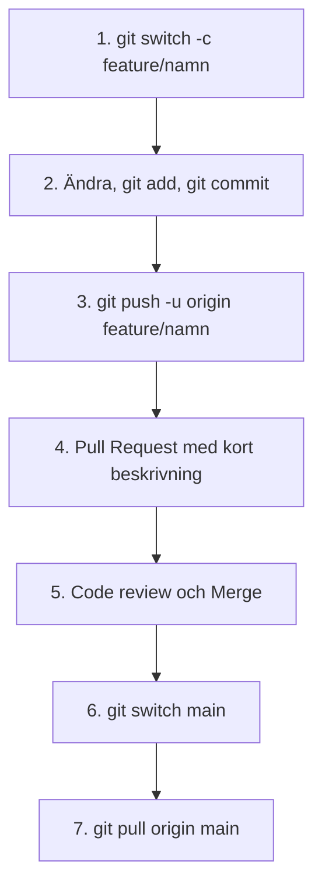
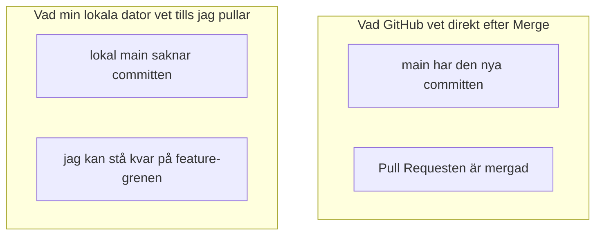
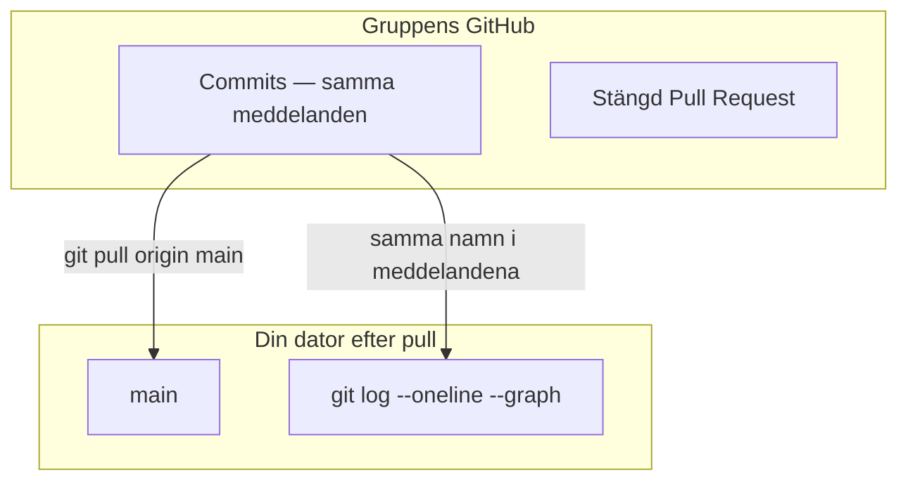
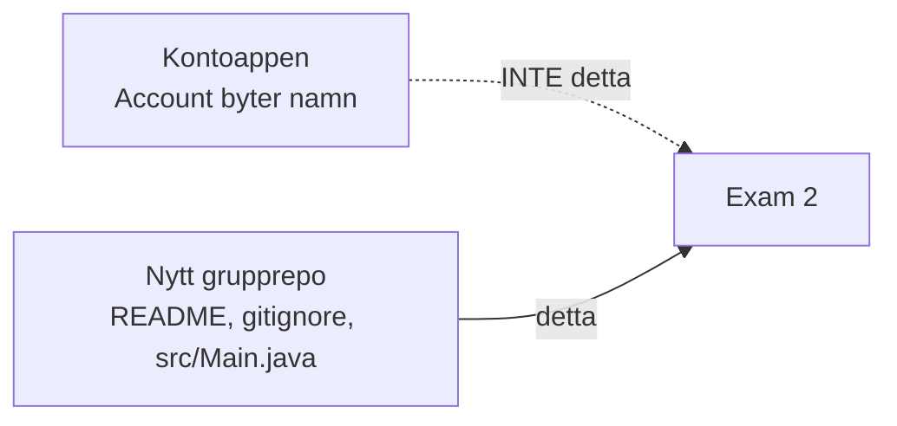

# 02 — Visuellt: original i arkiv, kopia på remiss

Samma modell som i [01 — Teoriguide](./01-teoriguide.md): **`main` är master-dokumentet i arkivet**, feature-grenen är **arbetskopian på remiss**. Kartorna nedan är flödet, gapet mellan moln och disk, och vad loggen visar efter pull. Ingen konfliktmarkör-karta och ingen klassarkitektur.

GitHub renderar diagrammen automatiskt.

---

## Diagram 1 — remissen blir Pull Request, sedan original

**Vad diagrammet visar:** Arbetskopian lämnar din dator och landar som en Pull Request. En annan person läser diffen innan originalet rör sig.  
**Kom ihåg:** Tre Exam 1-repos är inte ett team. `git push origin main` från din dator är inte det här flödet.

---

## Diagram 2 — de sju stegen

Läs uppifrån och ner. Steg 4 och 5 händer i webbläsaren. Steg 6 och 7 händer i terminalen, **efter** klicket, och båda i gruppen kör dem. I övningarna heter grenarna `feature-titel`, `feature-medlemmar` och `feature-src-start`.

**Målsvar (säg högt / skriv i README):** *"switch -c, add, commit med namn, push -u origin, Pull Request, en kollega mergar, switch main, pull origin main."*

---

## Direkt efter Merge — två exemplar

Knappen är klickad. Inget mer har hänt i din terminal.

De två rutorna har ingen pil mellan sig. GitHub stänger inte gapet åt dig.

| | GitHub, sekunden efter Merge | Din dator, innan pull |
| :--- | :--- | :--- |
| `main` | Har titeln, sektionen eller `src/Main.java` | Saknar det som just mergades |
| Var du står | Spelar ingen roll för molnet | Ofta kvar på feature-grenen |
| Nästa `git switch -c` | Skulle utgå från ny `main` | Utgår från gammal `main` om du inte pullat |

Nästa gren föds då i det förflutna: tidslinjen startar innan arkivet fick den senaste committen.

**Målsvar (säg högt / skriv i README):** *"Merge uppdaterar bara GitHub. Utan git switch main och git pull origin main föds nästa feature-gren från en gammal main."*

---

## Efter pull — samma historik på två ställen

Pilen går från arkivet till din dator. Varje rad i grafen är en commit. Namnet i meddelandet är personen. En skarv betyder att en feature-gren mött `main`, oftast vid Merge. Det är inte en konflikt i filen.

Öppna fliken **Commits**. Att filerna syns under **Code** räcker inte ensamt.

---

## Vad arkivet inte ska ta emot

| Mönster i `.gitignore` | Vad det är | Varför det stannar på din dator |
| :--- | :--- | :--- |
| `*.class` | Det `javac` skriver | Binärt resultat, olika varje kompilering |
| `target/` | Byggmapp | Genereras. Hör inte till källkoden |
| `.idea/` | IDE:ns egna filer | Din maskins inställningar, inte gruppens |

**Målsvar (säg högt / skriv i README):** *".gitignore håller *.class, target/ och .idea/ borta. De är resultat på min dator, inte källkod gruppen delar."*

---

## Nytt projekt

**Kom ihåg:** Exam 2 är ett nytt projekt. `src/Main.java` i det här paketet är en startkommentar. Klasser kommer senare.

**Målsvar (säg högt / skriv i README):** *"Exam 2 är ett nytt projekt. Vi kopierar inte Kontoappen och byter inte namn på Account."*

---

## Checkpoint (privat)

Utan att titta på teoriguiden: säg högt (1) de sju stegen, (2) skillnaden mellan GitHubs `main` och din `main` direkt efter Merge, (3) varför `*.class` inte ska committas. Jämför sedan med diagrammen.

När kartan sitter: [03 — Övningar](./03-ovningar.md).
