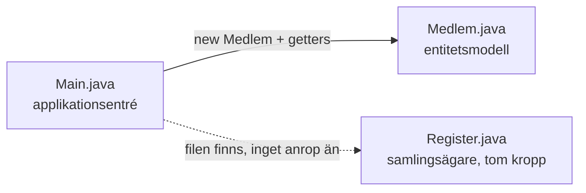
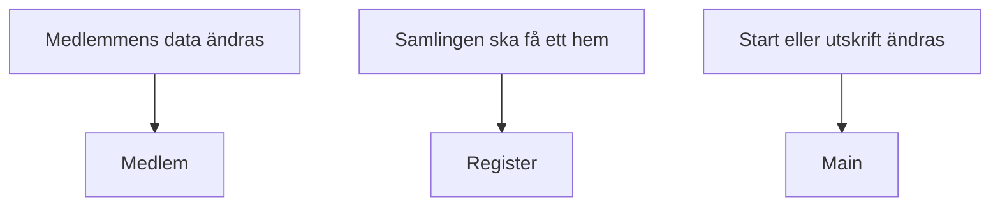
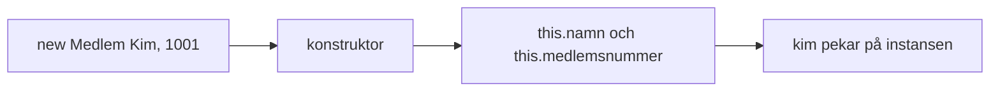
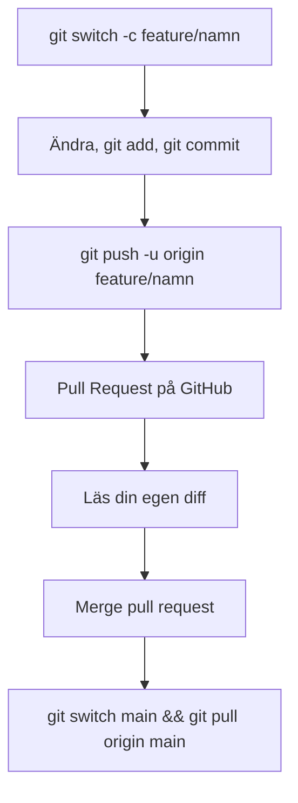
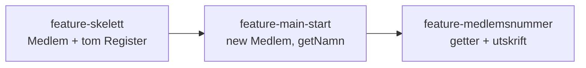
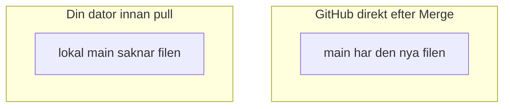

# 02 — Visuellt: entitet, samlingsägare, entré

Samma modell som i [01 — Teoriguide](./01-teoriguide.md). `Medlem` är databäraren. `Register` är domänens samlingsägare. `Main` är applikationsentrén. GitHub renderar diagrammen automatiskt.

---

## Tre adresser



**Vad diagrammet visar:** Entrén skapar en medlem och läser den via publika metoder. Samlingsägaren ligger i projektet utan att `Main` fyller den.

**Målsvar (säg högt / skriv i README):** *"Medlem är databäraren. Register är samlingsägaren, tom i det här skedet. Main är applikationsentrén."*

---

## Ett ansvar var



Lösa `namn1` och `nummer1` i `Main` ger entrén alla tre skälen att ändras. Ett par kan dessutom glida isär: namnet byts, numret blir kvar.

---

## Tillståndet sitter i entiteten

```mermaid
flowchart TB
  subgraph main["Main"]
    call["getNamn / getMedlemsnummer"]
  end
  subgraph medlem["Medlem"]
    ctor["konstruktor"]
    fields["private namn, medlemsnummer"]
  end
  ctor --> fields
  call -->|"returnerar värdet"| fields
```

Konstruktorn skriver fälten. Getters läser dem. `kim.namn` från `Main` når inte fram.

**Målsvar (säg högt / skriv i README):** *"private fält sätts i konstruktorn. Main läser med getters."*

---

## Ett anrop, en hel medlem



Klassen är mallen. `kim` är objektet.

---

## Ensam utvecklare, en feature i taget



Steg D, E och F händer i webbläsaren. Steg G händer i terminalen efter klicket. Utan G har `main` på din dator inte filen som GitHub redan visar.

I övningarna, i den här ordningen:



Varje pil förutsätter att du pullat `main` innan nästa gren skapas.

**Målsvar (säg högt / skriv i README):** *"Jag läser diffen, mergar på GitHub, och kör git switch main och git pull origin main innan nästa gren."*

---

## Efter Merge är kopiorna olika tills du pullar



Rutorna har ingen pil mellan sig. `git pull origin main` är pilen du själv kör, efter `git switch main`.

---

## Checkpoint (privat)

Säg högt: de tre adresserna, varför `private` stoppar `kim.namn`, och de två kommandona efter din egen Merge. Jämför sedan med diagrammen.

När kartan sitter: [03 — Övningar](./03-ovningar.md).
