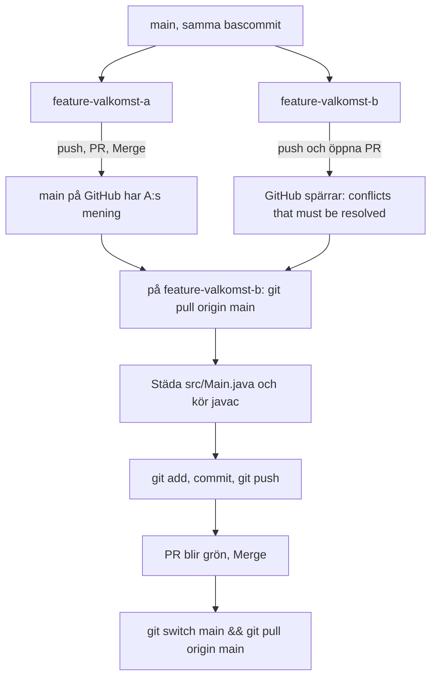
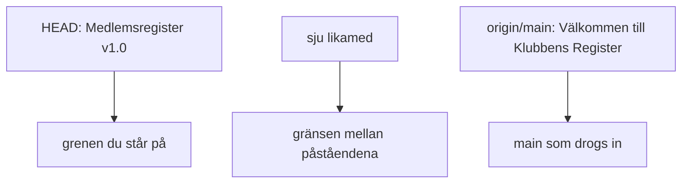
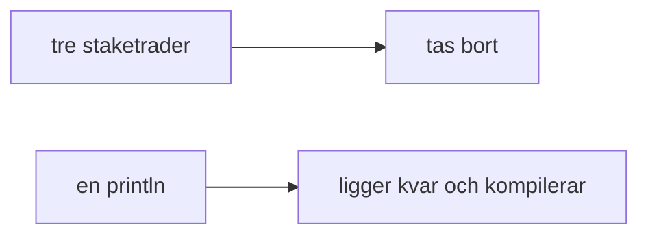
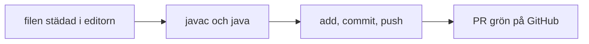
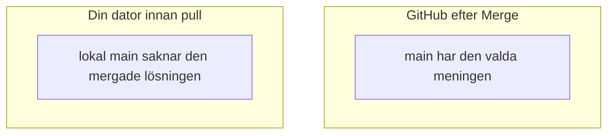

# 02 — Visuellt: två påståenden, en skiljedom

Samma modell som i [01 — Teoriguide](./01-teoriguide.md). Två grenar från samma bas ändrar samma `println`. GitHub spärrar den andra Pull Requesten. Du avgör raden lokalt, kör `javac`, och pushar så att Pull Requesten blir grön.

GitHub renderar diagrammen automatiskt.

---

## Från gemensam bas till grön Pull Request



**Vad diagrammet visar:** A:s Pull Request går in i originalet. B:s Pull Request öppnas från den gamla basen och stoppas. Rättningen pushas på B:s gren. Först därefter blir den grön.

Gren B skapas från den lokala `main` som ännu inte har A:s merge. En pull mellan Merge och `git switch -c feature-valkomst-b` tar bort krocken.

**Målsvar (säg högt / skriv i README):** *"A mergas. B spärras. Jag drar in main på B, städar, pushar. Då blir Pull Requesten grön."*

---

## De två påståendena i filen

När du står på `feature-valkomst-b` och har kört `git pull origin main`:

```text
<<<<<<< HEAD
        System.out.println("Medlemsregister v1.0");
=======
        System.out.println("Välkommen till Klubbens Register!");
>>>>>>> origin/main
```



Över gränsen finns ditt påstående på feature-grenen. Under gränsen finns påståendet som redan ligger på GitHubs `main`.

---

## Vad som ska bort



Kvar i filen finns en vanlig rad, till exempel:

```text
        System.out.println("Välkommen till Klubbens Register!");
```

`<<<<<<<`, `=======` och `>>>>>>>` är borta. Båda meningarna får inte ligga kvar under varandra om du inte medvetet vill skriva ut två rader. I övningen behåller du en.

**Målsvar (säg högt / skriv i README):** *"Jag tar bort de tre staketraderna. HEAD var min gren. origin/main var meningen som redan mergats."*

---

## Varför push väntar på javac



Webbläsaren kan inte köra `javac`. En push före provkörningen kan göra Pull Requesten grön med en rad som inte startar.

---

## Efter Merge har du två exemplar igen



Rutorna har ingen pil mellan sig. Du drar pilen själv:

```text
git switch main && git pull origin main
```

`git log --oneline --graph` visar därefter mötet mellan grenarna.

---

## Checkpoint (privat)

Säg högt: varför GitHub spärrar B, vilken sida som är `HEAD`, och varför `javac` sitter före `git push`. Jämför sedan med diagrammen.

När kartan sitter: [03 — Övningar](./03-ovningar.md).
